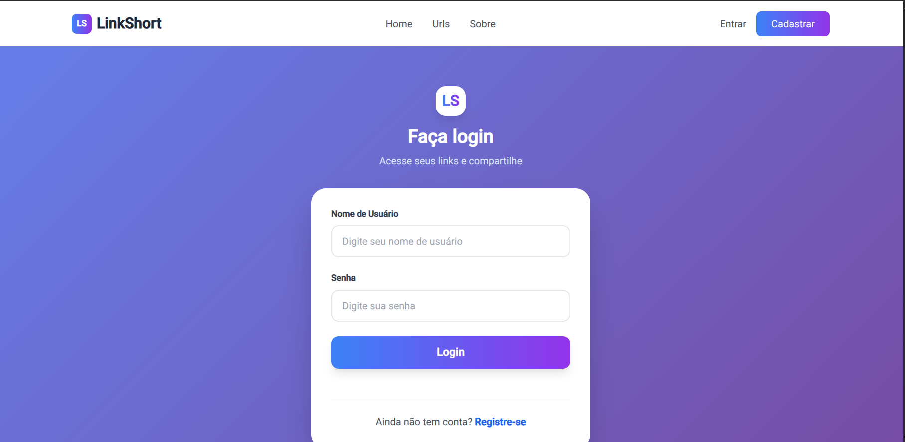

# LinkShortUi – Interface Web (Frontend)

O **LinkShortUi** é o frontend do projeto **LinkShort**, um encurtador de URLs moderno e eficiente.  
Desenvolvido com **Angular + TypeScript**, ele oferece uma interface intuitiva, responsiva e totalmente integrada ao backend.

---

## Tecnologias Utilizadas

- **Angular** (Framework principal)
- **TypeScript**
- **RxJS** e **Angular Services** para comunicação com o backend
- **TailwindCss / Angular Material** (design e responsividade)
- **JWT** para autenticação

---

## Funcionalidades

- 🔗 Criação e gerenciamento de URLs encurtadas  
- 📊 Dashboard com estatísticas de acessos  
- 🔐 Autenticação e controle de usuários (JWT)  
- 🧭 Navegação moderna e responsiva  
- 🎨 Design limpo e profissional  

---

## Prévia da Interface

Abaixo estão algumas capturas de tela da interface do **LinkShortUi**:

| Tela de Login | Dashboard | Criação de Link |
|:--------------:|:----------:|:----------------:|
|  |  |  |

---

## Como Executar Localmente

1. **Clonar o repositório**
   ```bash
   git clone https://github.com/seu-usuario/LinkShortUi.git

2. **Instalar as dependências**
   ```bash   
   npm install

3. **Executar o servidor de desenvolvimento**
   ```bash 
   ng serve

4. **Abrir no navegador**
   ```bash 
   http://localhost:4200

---

## 🔗 Integração com o Backend

O **LinkShortUi** se comunica com o backend do projeto **LinkShort** através de requisições HTTP autenticadas com **JWT**.

Certifique-se de que o backend esteja em execução antes de iniciar o frontend.  

---

## 📘 Documentação da API (Swagger / OpenAPI)

A documentação da API do **LinkShort** foi gerada com **Swagger (OpenAPI)** e está disponível diretamente no backend.

Para acessá-la:

http://localhost:8080/swagger-ui/index.html

*(O endereço pode variar conforme a configuração do seu ambiente.)*

---

## 📄 Licença

Este projeto é distribuído sob a licença **MIT**.  
Sinta-se à vontade para usar, modificar e contribuir!


## Contato

Desenvolvido por **[Bruno Tomaz]**  
📧 Email: [brunotomaaz@yahoo.com](mailto:seu.email@exemplo.com)  
🌐 Linkedin: [Bruno Tomaz](https://www.linkedin.com/in/bruno-tomaz-5232451b2/)


